# Universial ToolBox开发文档

> 组长：[杨弘](https://skywalkerdarren.github.io)
>
> 组员：徐祥亮，朱可欣

## 目录

* [1 概述](#1-概述)
    * [1.1 开发背景](#11-开发背景)
    * [1.2 开发目标](#12-开发目标)
    * [1.3 参考资料](#13-参考资料)
    * [1.4 设计原则](#14-设计原则)
* [2 需求分析](#2-需求分析)
    * [2.1 需求陈述](#21-需求陈述)
    * [2.2 功能分析划分](#22-功能分析划分)
    * [2.3 运行环境](#23-运行环境)
* [3 总体设计](#3-总体设计)
    * [3.1 类图设计](#31-类图设计)
        * [3.1.1 全局图](#311-全局图)
        * [3.1.2 主界面UI](#312-主界面UI)
        * [3.1.3 计算器](#313-计算器)
        * [3.1.4 汇率](#314-汇率)
        * [3.1.5 换算](#315-换算)
        * [3.1.6 历史记录](#316-历史记录)
        * [3.1.7 日期](#317-日期)
        * [3.1.8 编码解码](#318-编码解码)
        * [3.1.9 二维码](#319-二维码)
        * [3.1.10 截图](#3110-截图)
    * [3.2 接口设计](#32-接口设计)
    * [3.3 界面设计](#33-界面设计)
        * [3.3.1 启动欢迎界面](#331-启动欢迎界面)
        * [3.3.2 程序主界面](#332-程序主界面)
        * [3.3.3 截图画图界面](#333-截图画图界面)
        * [3.3.4 科学计算器界面](#334-科学计算器界面)
        * [3.3.5 程序员计算器界面](#335-程序员计算器界面)
        * [3.3.6 汇率计算器界面](#336-汇率计算器界面)
        * [3.3.7 单位换算器界面](#337-单位换算器界面)
        * [3.3.8 日期计算器界面](#338-日期计算器界面)
        * [3.3.9 Base64编码/解码界面](#339-base64编码解码界面)
        * [3.3.10 Unicode中文互转界面](#3310-unicode中文互转界面)
        * [3.3.11 MD5生成校验界面](#3311-md5生成校验界面)
        * [3.3.12 文字/文件编码批量转换界面](#3312-文字文件编码批量转换界面)
        * [3.3.13 二维码生成界面](#3313-二维码生成界面)
        * [3.3.14 关于界面](#3314-关于界面)
* [4 详细设计](#4-详细设计)
    * [4.1 程序流程图](#41-程序流程图)
        * [4.1.1 主流程](#411-主流程)
        * [4.1.2 计算器](#412-计算器)
        * [4.1.3 汇率](#413-汇率)
        * [4.1.4 换算](#414-换算)
        * [4.1.5 日期计算](#415-日期计算)
        * [4.1.6 历史记录](#416-历史记录)
        * [4.1.7 编码解码](#417-编码解码)
        * [4.1.8 二维码](#418-二维码)
        * [4.1.9 截图](#419-截图)
* [5 实现](#5-实现)
    * [5.1 编码](#51-编码)
        * [5.1.1 开发环境](#511-开发环境)
        * [5.1.2 代码约定](#512-代码约定)
        * [5.1.3 代码编写原则](#513-代码编写原则)
    * [5.2 测试要点](#52-测试要点)
    * [5.3 测试结果和总结](#53-测试结果和总结)
* [6 维护](#6-维护)
    * [6.1 维护方法](#61-维护方法)
    * [6.2 维护文档](#62-维护文档)
    * [6.3 功能拓展方法](#63-功能拓展方法)

## 1 概述

### 1.1 开发背景

为了提高计算机计算的相关人员，需要管理网站编码的站长以及经常依赖高精度计算的金融相关人员的计算方便而设计了一套计算及编码工具，还囊括了各种常用的小工具来提高系统的易用性，成为方便用户的日常使用的万能工具箱。

### 1.2 开发目标

该工具箱要求的工具有如下几个：

1. 计算换算工具
    1. 科学计算器
    1. 程序员计算器
    1. 汇率计算器
    1. 单位换算器
    1. 日期计算器
1. 编码解码工具
    1. Base64 编码解码
    1. Unicode 中文互相转换
    1. MD5 校验生成工具
    1. 文字/文件编码批量转换工具
1. 二维码生成工具
1. 截图工具

### 1.3 参考资料

工具箱所用到的package有

* *Big-math* 用于大数的高精度计算
* *zxing* 二维码生成及校验的工具包
* *gson* 用于json数据的解析
* *joda-time* 代替Date类的高精度日期工具

### 1.4 设计原则

要求跨平台可用，数据持久化，易于拓展新的工具功能。

## 2 需求分析

### 2.1 需求陈述

1. 科学计算器
    * 有四则运算，乘方运算，10为底的对数，阶乘和三角函数运算
    * 三角函数为弧度制
    * 具有优先级
    * 实现回退，清空，清除操作
    * 结果可复制
    * 监听键盘事件
1. 程序员计算器
    * 二进制，八进制，十进制，十六进制转换
    * 64位长整形运算
    * 全键盘支持四则运算，位运算
    * 实现回退，清空，清除操作
    * 结果可复制
    * 比特键盘可直接操纵二进制数据
1. 汇率计算器
    * 初始内置一套汇率数据
    * 若联网则可以更新最新汇率，并持久化保存数据
    * 显示当前汇率及更新日期
1. 单位换算器
    * 支持长度，面积，体积，速度，质量，温度，角度的单位换算
    * 支持大部分常用的市制，公制，英制，美制的标度换算
1. 日期计算器
    * 具有日期间隔计算，计算结果为周期和相差总天数
    * 具有日期增减计算，结果为某日期增减后所得的日期

除了日期计算器外，其他计算器均支持高精度计算，以及历史记录功能。历史记录功能需要记录计算器输出的结果，并可以在各个计算器之间互相调用（除日期计算器外），程序员计算器的历史记录要求只保存十进制数据，而且调用时将先转换为长整型十进制再使用。

1. Base64 编码解码，Unicode 中文互转
    * 要求能对数据进行编码及解码
    * 可以进行文本的复制及粘贴
1. MD5 校验生成工具
    * 要求可以对文件进行校验
    * 要求可以对字符串文本进行消息摘要
    * 生成为32位大写消息摘要
1. 文字/文件编码批量转换工具
    * 支持`utf-8`,`BIG5`,`GBK`,`GB2312`,`JIS`,`SJIS`的编码互相转换
    * 可以对目录下所有文本文件的编码进行转换
    * 可以对乱码字符串进行转换
1. 二维码生成工具
    * 支持纠错等级的选择
    * 支持图片大小的选择
    * 支持生成的二维码保存
    * 图片输出格式为`jpg`
    * 支持电脑上二维码的截图或文件识别
    * 二维码编码格式为`utf-8`
1. 截图工具
    * 截图时隐藏窗口
    * 右键退出截图
    * 支持对截图的简单绘画
    * 支持矩形，椭圆，钢笔，画笔粗细调节，颜色选择
    * 支持图片保存与复制
    * 图片输出格式为`png`

### 2.2 功能分析划分

总体分为前端和后端。

前端为各个UI的界面框架编写及背景美工。

* 启动画面
* 主界面
* 关于窗口
* 计算换算工具
    * 科学计算器
    * 程序员计算器
    * 汇率计算器
    * 单位换算器
    * 日期计算器
* 编码解码工具
    * Base64 编码解码
    * Unicode 中文互相转换
    * MD5 校验生成工具
    * 文字/文件编码批量转换工具
* 二维码生成工具
* 截图工具

后端划分为计算器包，汇率包，换算包，日期包，截图包，编码包,历史记录包，二维码包。

难点在于计算器包，截图包的实现。

要求输出的结果正确以及高效。

* 计算器包实现计算器的优先级逻辑，运算逻辑，表达式解析
* 汇率包实现最新汇率的抓取，汇率的持久化保存，json数据解析调用，货币保存
* 换算包实现各个单位对国际单位制的换算比例（除温度，角度），温度，角度则用公式进行换算
* 日期包实现日期计算，周期计算，日期获取
* 截图包实现截图的基本功能，图像控制
* 编码包实现对编码的解码和转换
* 历史记录包实现对结果的记录和使用
* 二维码包实现对二维码的编码解码

### 2.3 运行环境

要求有Java1.8的运行环境。

支持*nix，Windows，Mac。

## 3 总体设计

### 3.1 类图设计

#### 3.1.1 全局图

#### 3.1.2 主界面UI

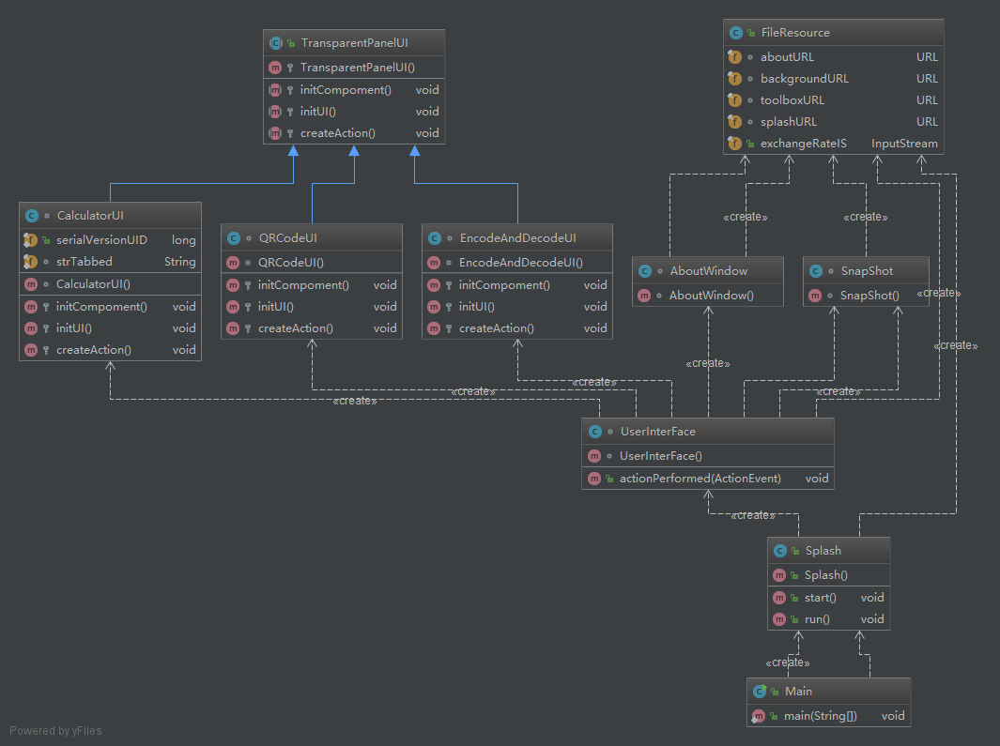

#### 3.1.3 计算器

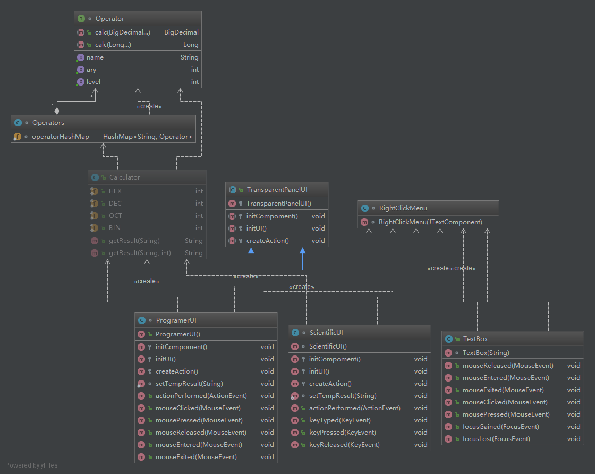

#### 3.1.4 汇率

#### 3.1.5 换算

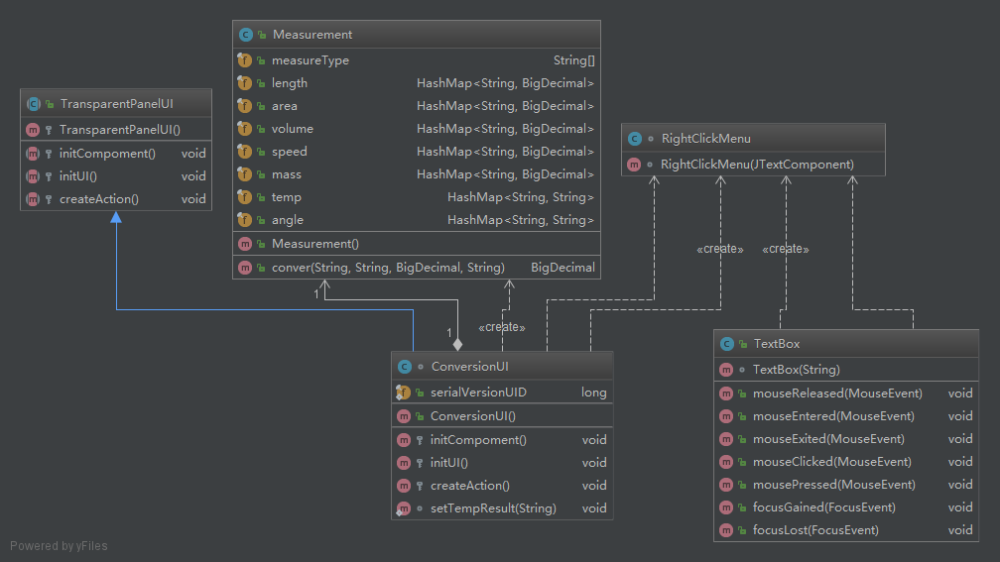

#### 3.1.6 历史记录

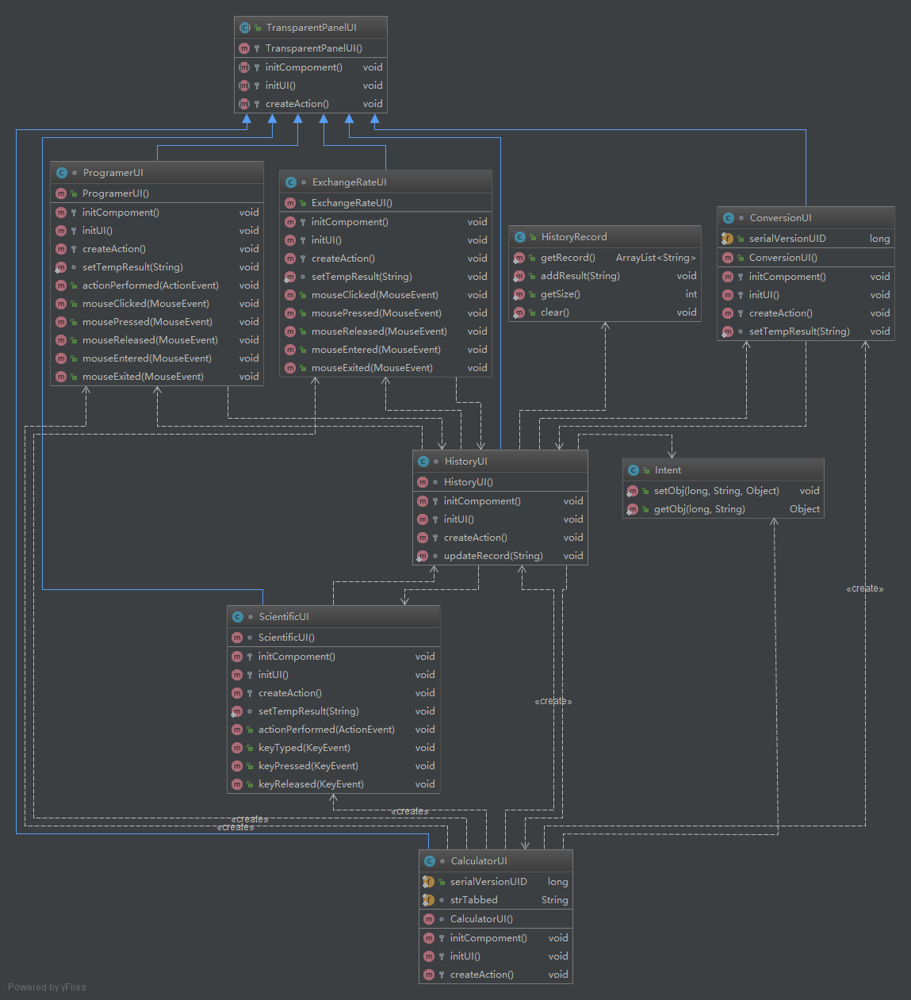

#### 3.1.7 日期

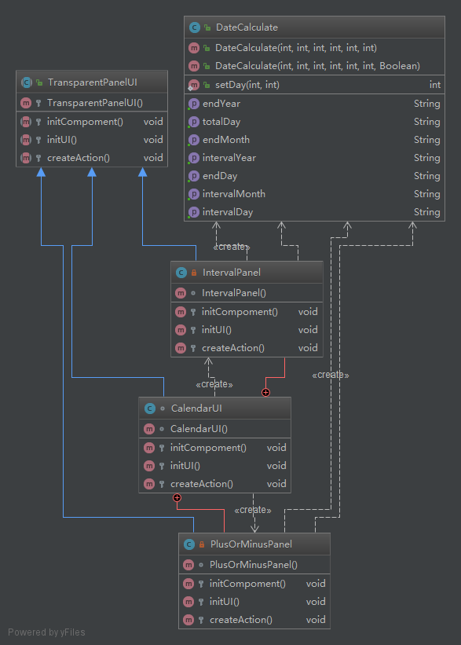

#### 3.1.8 编码解码

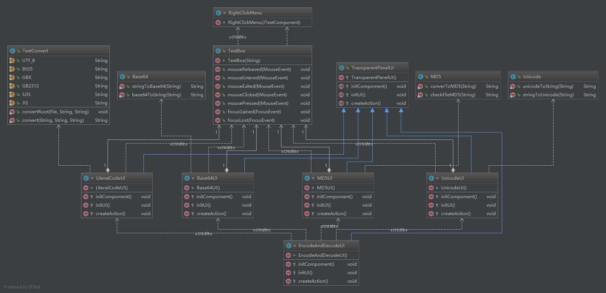

#### 3.1.9 二维码

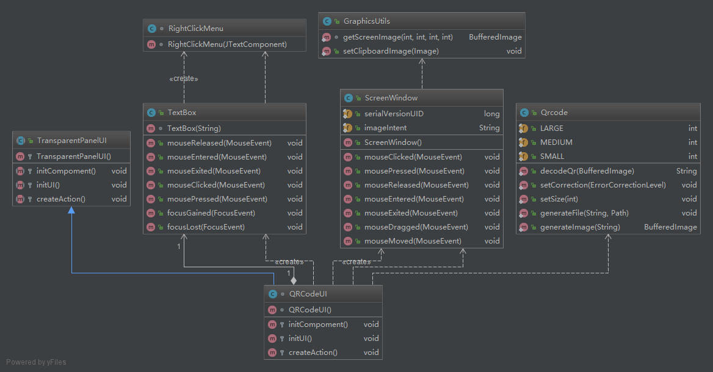

#### 3.1.10 截图

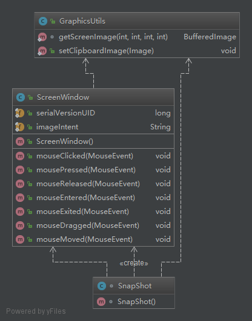

### 3.2 接口设计

参见[Javadoc](https://skywalkerdarren.github.io/toolbox/)

### 3.3 界面设计

#### 3.3.1 启动欢迎界面

* 设置界面等待光标为Cursor.WAIT_CURSOR
* 进度条JProgressBar设置进度条长度。
* 面板容器Container加载工具箱封面，设置布局。
* 加载工具箱图标，背景封面等信息。
* 设置欢迎界面为屏幕居中显示。

#### 3.3.2 程序主界面

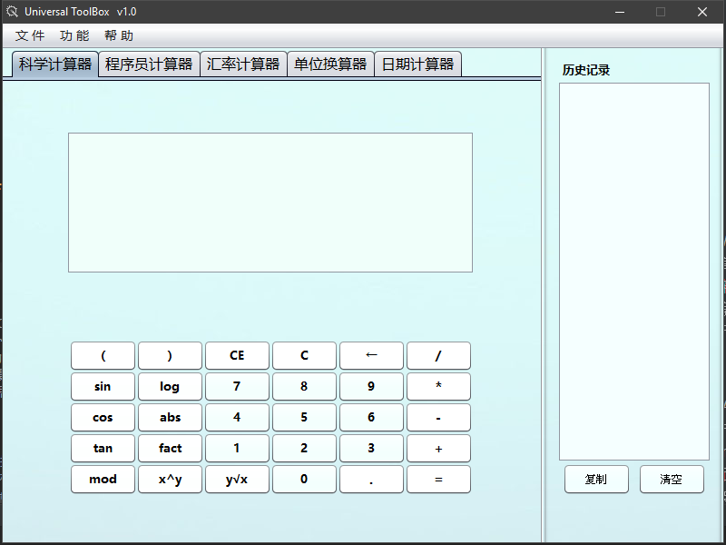

* 继承JFrame类，事件接口为ActionListener。
* 程序界面添加JPanel标签页布局为卡片布局CardPanel。
* 添加主界面背景paintComponent 。
* 初始化主程序设置JFrame界面管理器UIManager中nimbus风格。
* 框架初始化，加载程序主框架initializeFrame，框架类型居中显示。
* 设置界面字体Consolas，组件长度，组件宽度。
* 界面窗口属性为WindowConstants.EXIT_ON_CLOSE。  	

菜单栏界面：

* 设置菜单工具栏字体font为”微软雅黑”。
* 设置菜单工具栏颜色RGB (240, 255, 255)。
* 设置菜单工具栏大小dimensionStart，dimenFunction，dimensionAbout；
* 添加菜单栏；文件MenuStart、功能MenuFunction、帮助MenuHelp。

菜单栏层级：

* 文件
    * 截图 
    * 退出
* 功能
    * 计算换算工具
        * 科学计算器
        * 程序员计算器
        * 汇率计算器
        * 单位换算器
        * 日期计算器
    * 编码解码工具
        * Base64编码/解码
        * Unicode中文互转
        * MD5生成校验
        * 文字/文件编码批量转换
    * 二维码生成
* 帮助
    * 关于

文件菜单栏：

* 打开文件菜单，点击截图功能。
* 打开文件菜单，点击退出菜单menuItemExit，程序退出。

#### 3.3.3 截图画图界面

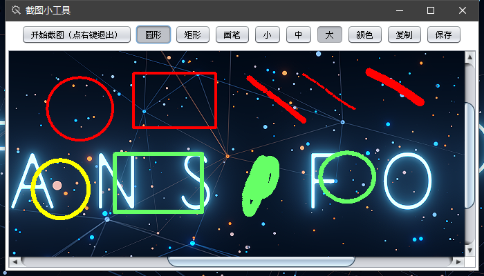

* 继承JFrame；截图功能添加截图窗口事件监听WindowListener。
* 添加截图面板SnapShot，设置截图面板大小、设置标题、居中显示。
* 设置界面按钮：圆形、矩形、画笔、小、中、大、颜色、保存、复制。
* 界面容器container设置边缘布局BorderLayout。

#### 3.3.4 科学计算器界面

* 初始化组件、布局、建立监听事件，构造计算器布局ScientificUI。
* 设置从0~9各个数字键；各个三角函数、左括号、右括号、取模。
* 添加按钮组，设定存储结果，添加各个按钮事件。添加括号优先级。
* 可判断是否为数字的一部分，可判断前一字符是否为空格等。

#### 3.3.5 程序员计算器界面

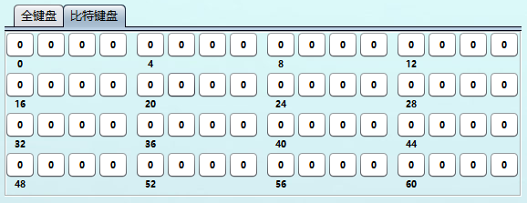

* 支持二进制键盘0、1；对数值进行进制转换，位运算等。
* 初始化组件、布局、建立监听事件、初始化UI窗口。
* 摆放控件位置及设定基本配置ProgrammerUI、添加按钮组buttonGroup。
* 设定从历史记录所获取的结果，显示到UI上并加载到表达式中。

#### 3.3.6 汇率计算器界面

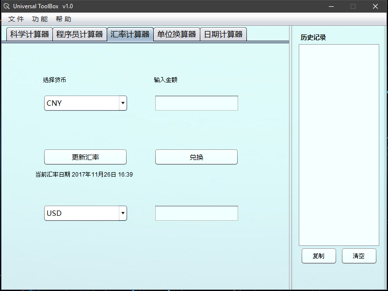

* 汇率转换，默认使用内置汇率，可以从网上获取最新汇率。
* 初始化组件initCompoment、初始化布局initUI。
* 添加文本框textFieldSource、兑换及选择汇率标签JLabel。
* 建立监听事件createAction、构造汇率兑换布局ExchangeRateUI。
* 设定从历史记录所获取的结果，显示到UI上并加载到表达式中。

#### 3.3.7 单位换算器界面

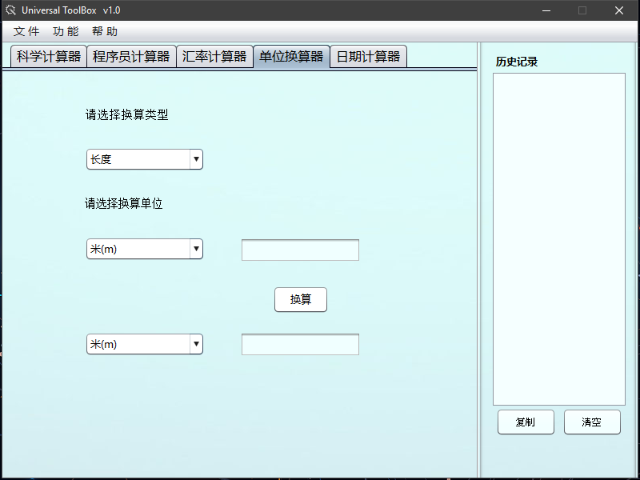

* 换算器，各单位进行换算并保存结果，支持历史记录功能。
* 初始化布局类型；源数值；源单位；目标数值；换算类型；换算单位。
* 建立监听事件，初始化换算计算器的基本构造ConversionUI。
* 设定从历史记录所获取的结果，显示到UI上并加载到表达式中。

#### 3.3.8 日期计算器界面

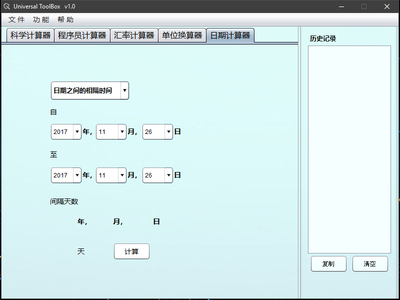

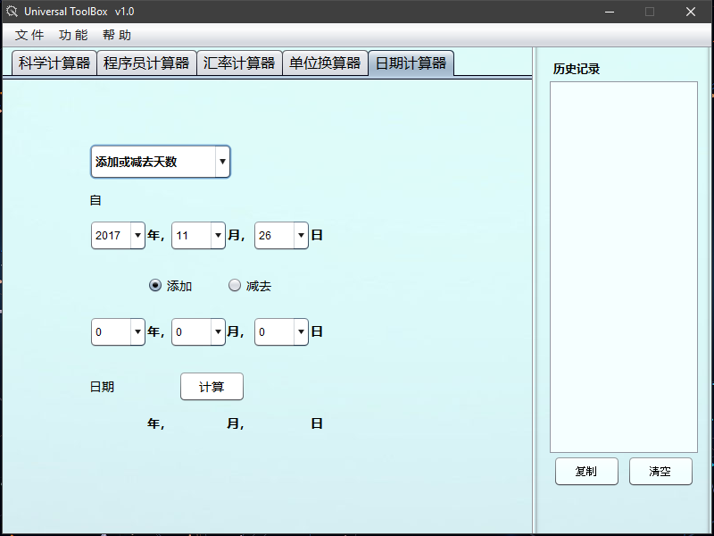

* 支持日期间隔计算及日期增减天数计算，显示总天数，周期时间。
* 初始化组件initCompoment、初始化布局initUI。
* 建立监听事件createAction、构建日期计算的UI基本框架。
* 添加日期距离类，获得两个日期额的间隔日期及总天数。
* 添加日期增减类，从一个已知日期增减一定的日期，来获得目标日期。

#### 3.3.9 Base64编码/解码界面

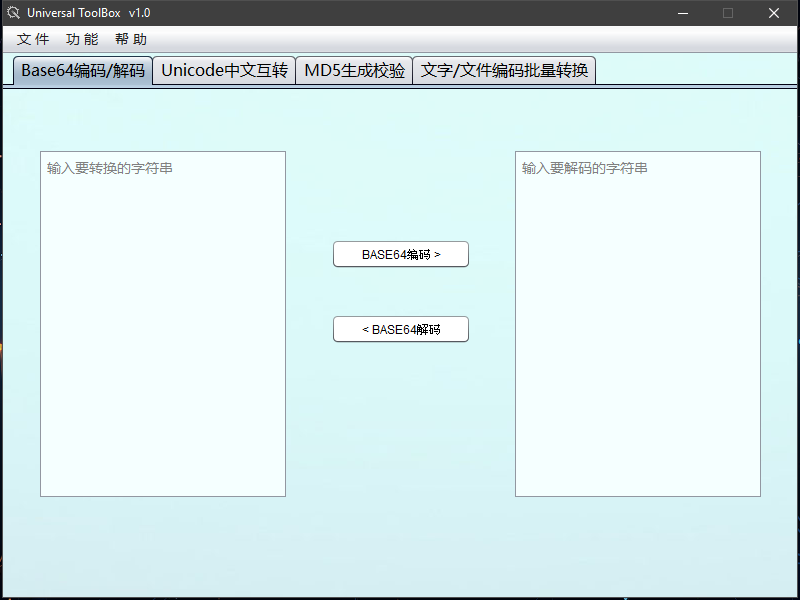

* base64解码的主面板，可以对编码进行base64编码与解码。
* 采用通用透明Panel，添加按钮组并建立监听事件。
* 初始化组件initCompoment、初始化布局initUI。
* 构造编码器框架Base64UI。

#### 3.3.10 Unicode中文互转界面

* 编码解码Unicode，支持中文Unicode互相转换。
* 初始化组件initCompoment、初始化布局initUI。
* 添加滚动页面JScrollPane、添加互转按钮JButton。
* 构造Unicode中文互转框架UnicodeUI。

#### 3.3.11 MD5生成校验界面

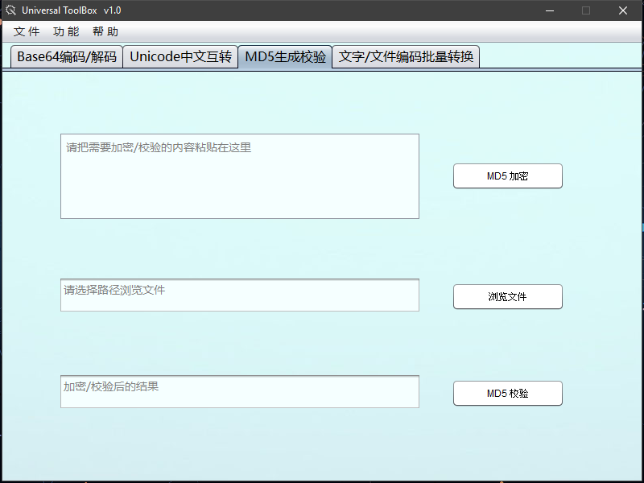

* 校验，支持文件校验，信息校验。
* 初始化组件initCompoment、初始化布局initUI。
* 初始化布局：上、中、下方文本框textField
* 构造MD5框架MD5UI。

#### 3.3.12 文字/文件编码批量转换界面

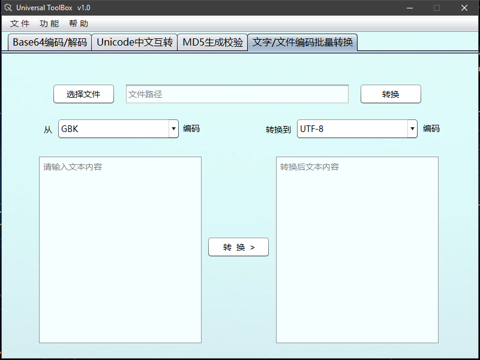

* 支持简体、繁体、日语、utf-8互相转换编码。
* 初始化组件initCompoment、初始化布局initUI。
* 添加选择文件、转换按钮；添加转换、编码标签JLabel。
* 添加成功修改的消息框SuccessDialog、初始化消息框窗口。
* 构造文字编码转换框架LiteralCodeUI。

#### 3.3.13 二维码生成界面

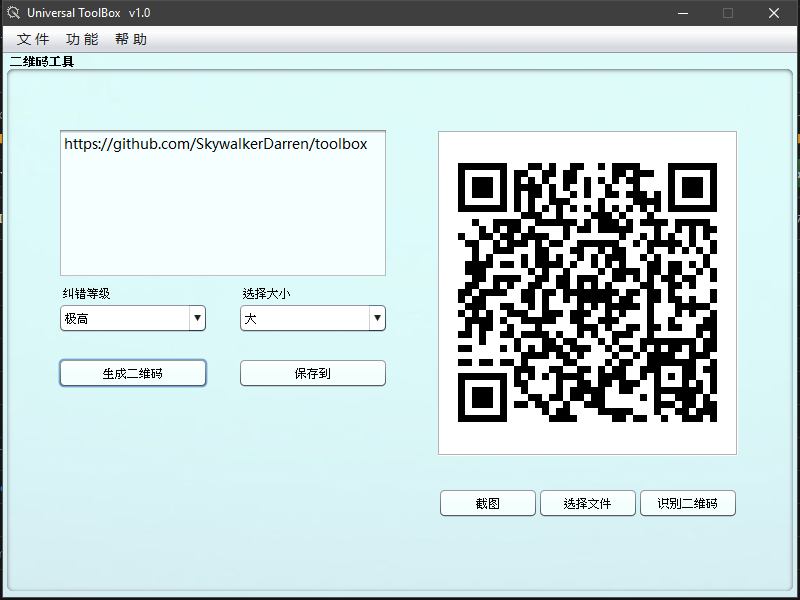

* 添加显示内容、纠错等级、选择大小生成二维码、截图、保存到等功能。
* 添加文件选择器JFileChooser组件，添加生成、保存、截图按钮。
* 初始化组件initCompoment、初始化布局initUI。
* 支持二维码生成与编辑，加载二维码界面QRCodeUI。

#### 3.3.14 关于界面

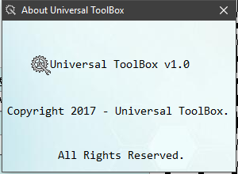

* 关于窗口，显示当前版本号。
* 初始化关于窗口AboutWindow，添加关于面板JPanel。
* 添加标签JLabel、工具箱属性、版本。
* 添加背景图ImageIcon，工具箱图标lblIcon。

## 4 详细设计

### 4.1 程序流程图

#### 4.1.1 主流程

主程序流程图

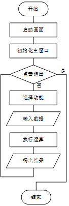

#### 4.1.2 计算器

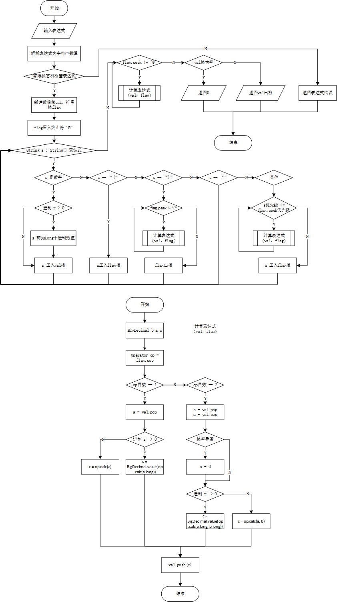

计算表达式由两个栈`（val，flag）`管理，计算则交给`calcExp`方法处理。

运算符为初始设定，`Operator`定义接口方法，`Operators`中由HashMap初始化实现并存储运算操作符。

这样如果添加新的操作符时只需从`Operators`类的HashMap中添加即可。

其中解析表达式的是有限状态机，状态转换表如下

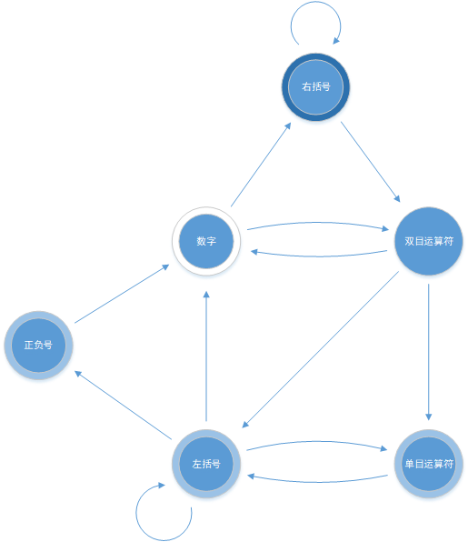

#### 4.1.3 汇率

初始化记录及计算流程

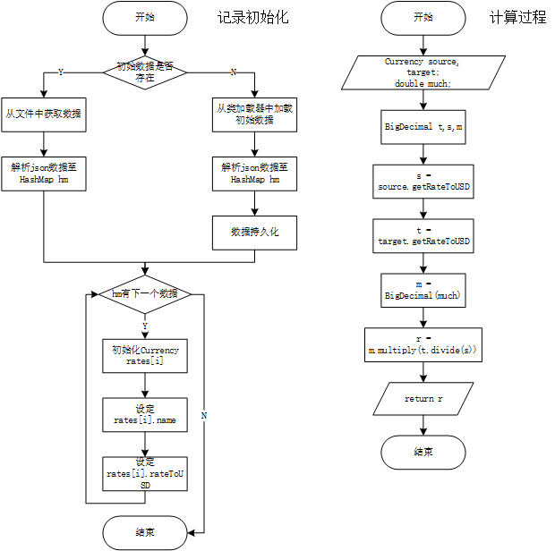

货币结构由`Currency`定义，如货币名称，兑美元汇率。

网上爬取记录流程

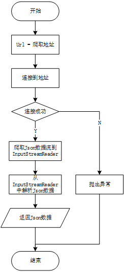

爬取的汇率均基于兑美元汇率。

#### 4.1.4 换算

#### 4.1.5 日期计算

也就是说该类由两个构造方法构成。

最后分别封装`endDate`的年，月，日的Getter方法，`period`的年，月，日，总天数Getter方法。

最终以供调用。

#### 4.1.6 历史记录

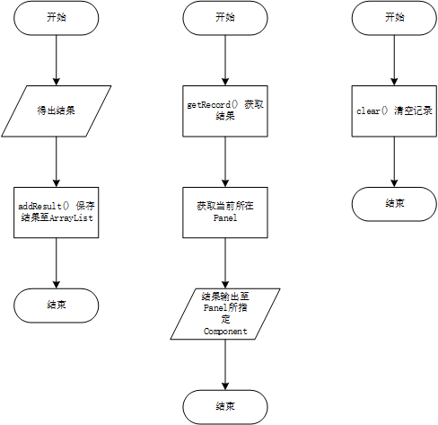

`Intent`来负责传递当前所在Panel位置

#### 4.1.7 编码解码

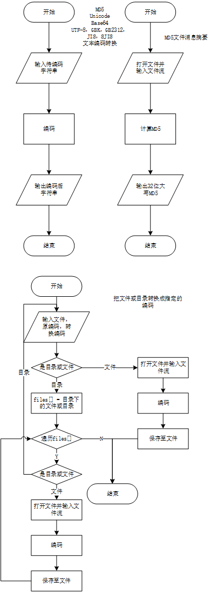

#### 4.1.8 二维码

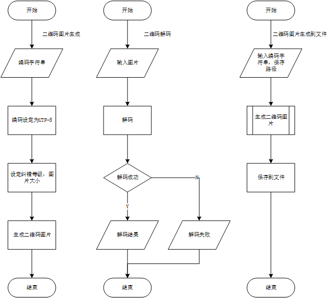

#### 4.1.9 截图

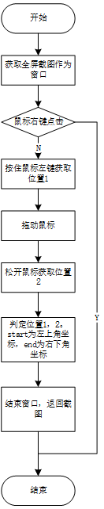

## 5 实现

### 5.1 编码

#### 5.1.1 开发环境

要求`JDK1.8`及以上。系统为64位Windows10，Windows7，Linux Arch等。

IDE为`idea`，用`findbugs`做静态代码分析，由`idea`生成`Javadoc`。

（`Eclipse`也可以，但不够方便）

`JUnit4`作为单元测试套件，由`idea`生成测试文档。

UML类图由`idea`生成。流程图由`Visio`绘制。

代码托管至`Github`，`Gitlab`，测试文档和接口文档由`Github Pages`托管。

#### 5.1.2 代码约定

UI变量名由控件缩写+名称构成如`btnPlus`，变量名**不能用拼音**,使用**小驼峰命名法**，类名使用**大驼峰命名法**，常量名一般为**下划线命名法**，缩进为4个空格，编码格式为`utf-8`。

#### 5.1.3 代码编写原则

`fingbugs`的错误尽可能少，功能分类打包，要求代码复用性高。易于拓展新功能，不能有代码警告*（允许部分弱警告）*，单词拼写正确，增加注释。

开发要求遵守设计模式6大原则。

### 5.2 测试要点

#### 5.2.1 单元测试

使用`JUnit4`测试各个后端包。

单元测试要求进行白盒测试，在时间充裕的情况下尽量要求行覆盖率达90%，路径覆盖率达80%，需要测试各个边界条件以求最大化减少bug的产生。

#### 5.2.2 集成测试

组合前端UI后的测试，要求黑盒测试，基本要求为功能正确，界面正常，性能达标，程序不崩溃，异常后能迅速回归正常状态，不为后续计算造成影响。需要测试边界条件的正确性。

#### 5.2.3 系统测试

模块测试，测试每个模块的程序是否有错误。组装测试，测试模块之间的接口是否正确。确认测试，测试整个软件系统是否满足用户功能和性能的要求。

### 5.3 测试结果和总结

[基本测试结果](https://skywalkerdarren.github.io/toolbox/coverage/index.html)

依然存在少许bug，总体不影响使用，bug正在解决，也在解决提出bug的人（滑稽

## 6 维护

### 6.1 维护方法

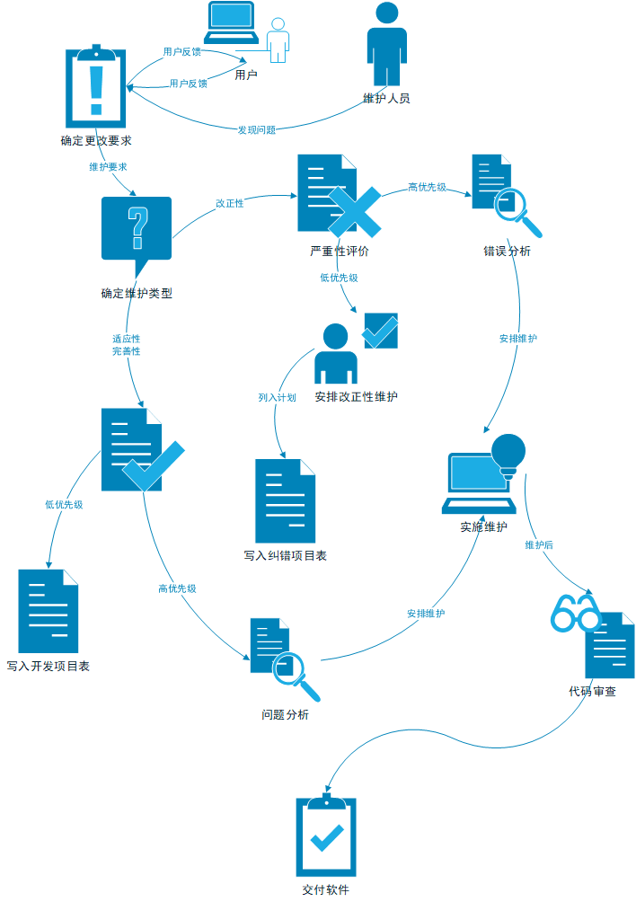

维护过程中使用Git版本控制。

常设分支`master`, `develop`。

开发新feature的时候要开新branch，branch命名为`feature_功能`。

修复Bug的时候开新branch，命名为`fixbug_Bug名`。

预发布的时候开新branch，命名为`release_版本号`。

临时性分支用完后需要删除。

### 6.2 维护文档

未进入此阶段，暂无。

### 6.3 功能拓展方法

新功能要求写成后端的功能包，具体调用由前端负责。绝不可冗杂在一起。

新一类的工具面板要求放在`UserInterface`的`mnMenuFunction`中，新面板要添加进`CardLayout`中。`JFrame`则要求放在`mnMenuStart`中，视情况需要添加窗口监视器。

如果是有多个子工具面板则需要添加`JTabbedPane`来存放子工具，子工具间的交互数据由`Intent`传递。

所有的`JPanel`要求继承至`TransparentPanelUI`。

资源文件放在`resource`文件夹中，再写进`FileResource`内，由类加载器调用。
